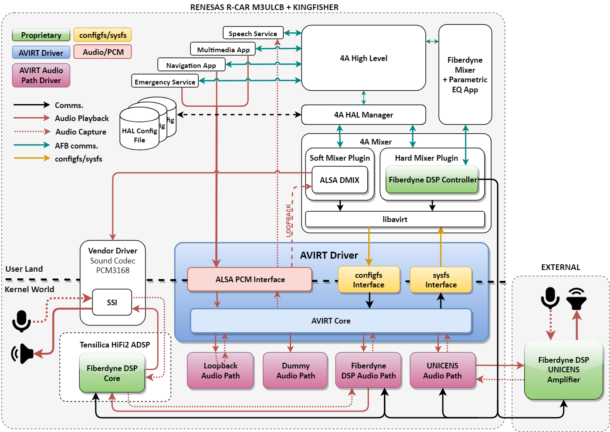

Introduction
===================

## Problem

The existing audio solution in [AGL](https://www.automotivelinux.org/) (Automotive Grade Linux) utilizes the ALSA loopback module together with [4a-softmixer](https://github.com/iotbzh/4a-softmixer). There are drawbacks to this solution:

1. Non-generic interface for configurable hardware cases

   - Unable to configure streams mapped to outputs

2. Not fully optimized for certain use cases (ie. Routing Audio to DSP vs. aloop)

   - Routing audio to hardware to reduce overhead

3. Inability to secure on all audio streams

   - Substreams cannot have SMACK labels applied, inherently leaving different audio streams insecure, or a single label applied to all.

## The AVIRT Solution

The ALSA Virtual Sound Driver (AVIRT) aims to provide a Linux kernel solution to the issue of audio routing in kernel-space, as well as security per audio stream, and dynamic configuration of audio streams at the kernel level.

AVIRT addresses the aforementioned problems by:

1. Providing a standard user-space interface via `configfs` to configure a variable number of 'streams' which can be mapped to audio paths.
2. Optimize the audio routing by connecting directly with the desired audio path. This can include routing audio through directly to hardware, to an implemented loopback interface, or to a DSP.
3. Each 'stream' is separated to its own ALSA PCM device, therefore differing security attributes can be applied to each 'stream'. This means that each of the audio roles can have separate security contexts from one another.

A top-level abstract dynamic audio driver is presented to the user-space via an ALSA middle-layer card. The card's PCM devices are configured using `configfs` via the accompanying userspace library [libavirt](https://github.com/fiberdyne/libavirt). The low-level "real" audio drivers can subscribe to the top-level as an "Audio Path". The Audio Path accepts routed audio streams from the abstracted top-level, and is then able to direct the audio streams accordingly.

The following Audio Paths are currently implemented for AVIRT:

- **ap_dummy** - This is provided as an example to show how a low-level audio driver would subscribe to AVIRT, and accept audio routing for playback.
- **ap_fddsp** - This is the Fiberdyne DSP hardmixer. This is only supported on the Renesas R-Car M3 AGL reference platform, and utilizes the HiFi2 DSP core to provide advanced DSP and audio mixing. An accompanying UI can be used to control the DSP parameters.
- **ap_loopback** - This is the default loopback for use with the softmixer. This is the stock AGL solution to be used to emulate the hardmixer when not available.
